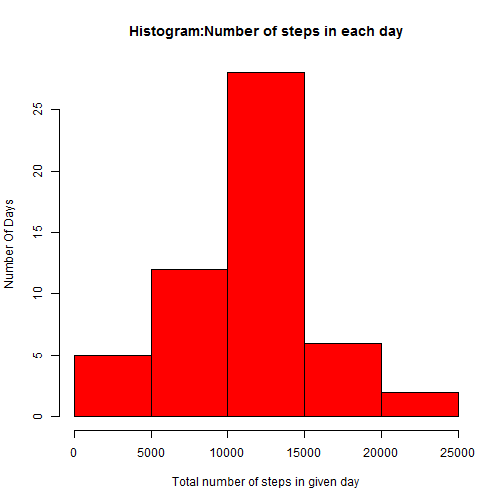
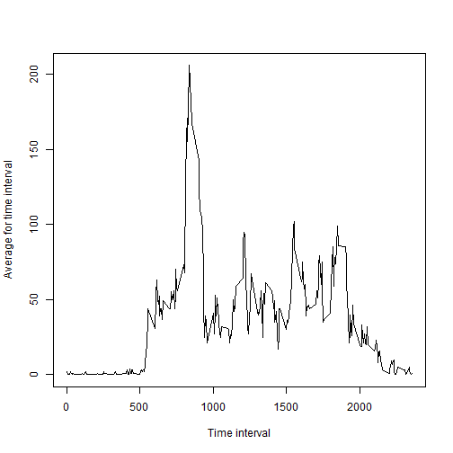
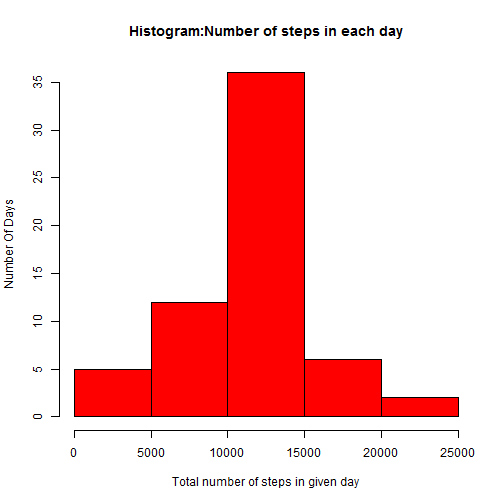
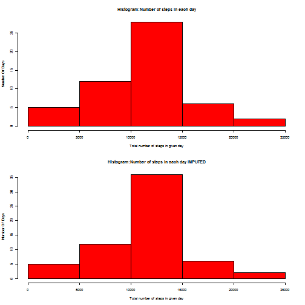
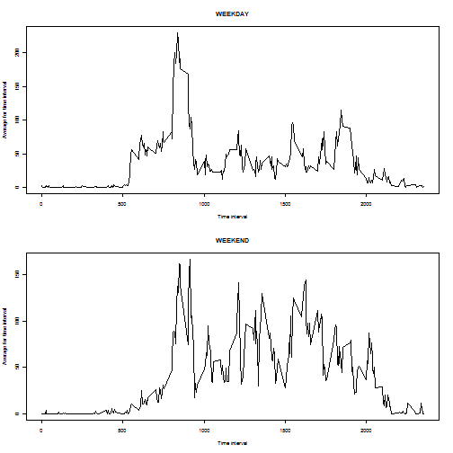

# Coursework assignment for reproducible research

This assignment makes use of data from a personal activity monitoring device. This device collects data at 5 minute intervals through out the day.The data consists of two months of data from an anonymous individual collected during the months of October and November, 2012 and include the number of steps taken in 5 minute intervals each day.

The data is taken from activity.csv which ahs the following columns:

-steps: Number of steps taking in a 5-minute interval (missing values are coded as  NA )

-date: The date on which the measurement was taken in YYYY-MM-DD format

-interval: Identifier for the 5-minute interval in which measurement was taken

### Read data
The first thing to do is read the data from the activity csv file.

*Note that this needs to be in you working directory*


```r
data <- read.csv("activity.csv",header=TRUE)
data$date <- as.Date(data$date)
```
Here is a summary of the data:

```r
summary(data)
```

```
##      steps             date               interval     
##  Min.   :  0.00   Min.   :2012-10-01   Min.   :   0.0  
##  1st Qu.:  0.00   1st Qu.:2012-10-16   1st Qu.: 588.8  
##  Median :  0.00   Median :2012-10-31   Median :1177.5  
##  Mean   : 37.38   Mean   :2012-10-31   Mean   :1177.5  
##  3rd Qu.: 12.00   3rd Qu.:2012-11-15   3rd Qu.:1766.2  
##  Max.   :806.00   Max.   :2012-11-30   Max.   :2355.0  
##  NA's   :2304
```

I will now analyze the data. To do so I shal answer the following questions:

*Note that this section of the analysis ignores missing values*

###What is mean total number of steps taken per day?

Summarise the data to caculate the total number of steps taken each day. THen create a histogram to portray these results.

```r
steps_by_date <- aggregate(data = data, steps ~ date, FUN = "sum")
hist(steps_by_date$steps, col="red", main="Histogram:Number of steps in each day", xlab="Total number of steps in given day", ylab = "Number Of Days")
```

 

Mean number of steps per day

```r
mean(steps_by_date$steps)
```

```
## [1] 10766.19
```
Median number of steps per day

```r
median(steps_by_date$steps)
```

```
## [1] 10765
```

###What is the average daily activity pattern?

Calculate the average number of steps taken in each time interval across the whole data collection period. Plot a line graph to show results.


```r
steps_by_time <- aggregate(data=data,steps ~ interval, FUN = "mean")
steps_by_time$steps <- round(steps_by_time$steps)

plot(steps_by_time$interval, steps_by_time$steps, typ="l", xlab="Time interval",ylab="Average for time interval")
```

 

By taking the highest average we can see what is the most active time interval is 

```r
with(steps_by_time, steps_by_time$interval[steps_by_time$steps == max(steps_by_time$steps)])
```

```
## [1] 835
```

###Imputing missing values

The number of missing values in the steps column is:

```r
length(data$steps[data$steps=="NA"])
```

```
## [1] 2304
```

Because of this I will now repeat the above analysis after imputing the missing values.

The first stage is to impute the missing data. 
I will take the mean for each time interval calculated earlier.

Merge the dataframes and rename the columns so I have the mean for each interval:

```r
data2 <- merge(data,steps_by_time,by="interval")
colnames(data2)[2] <- "steps"
colnames(data2)[4]  <- "mean"
```

Replace each missing value in the data frame with the mean for that given interval


```r
for (i in 1:nrow(data2) ) {
        if (is.na(data2$steps[i])==TRUE) {
                data2$steps[i] <- data2$mean[i]
        }
}
```
Remove the mean column as it is no longer required:


```r
data2$mean <- NULL
```

Repeat the analysis on new data frame and output a new histogram

```r
steps_by_date2 <- aggregate(data = data2, steps ~ date, FUN = "sum")
hist(steps_by_date2$steps, col="red", main="Histogram:Number of steps in each day", xlab="Total number of steps in given day", ylab = "Number Of Days")
```

 
Mean number of steps per day

```r
mean(steps_by_date2$steps)
```

```
## [1] 10765.64
```
Median number of steps per day

```r
median(steps_by_date2$steps)
```

```
## [1] 10762
```

As you can see comparing the graphs the trend is very similar.


```r
par(mfrow=c(2,1),cex=0.5)
hist(steps_by_date$steps, col="red", main="Histogram:Number of steps in each day", xlab="Total number of steps in given day", ylab = "Number Of Days")
hist(steps_by_date2$steps, col="red", main="Histogram:Number of steps in each day IMPUTED", xlab="Total number of steps in given day", ylab = "Number Of Days")
```

 

The mean and median are slightly higher after the imputation.
Here are the differences:

Mean:

```r
mean(steps_by_date$steps) - mean(steps_by_date2$steps)
```

```
## [1] 0.549335
```
Median:

```r
median(steps_by_date$steps) - median(steps_by_date2$steps)
```

```
## [1] 3
```

### Are there differences in activity patterns between weekdays and weekends?

Firstly I need to distinguish which days are weekdays and which are weekends. A new column *weekday* will be used as a factor.

*Note I have used the **imputed** dataframe for this analysis.*


```r
data3 <- data2
data3$weekday <- weekdays(data3$date)
for (i in 1:nrow(data3) ) {
        if (data3$weekday[i]=="Saturday" | data3$weekday[i]=="Sunday") {
                data3$weekday[i] <- "Weekend"
        } else {data3$weekday[i] <- "Weekday"}
}
```

From this I can now create sub dataframes for weekday and weekend.

Create weekday and weekend dataframe s

```r
data_weekdays <- data3[data3$weekday == "Weekday",]
data_weekends <- data3[data3$weekday == "Weekend",]
```

Run analysis on both dataframes and create graphs to compare:

```r
steps_by_time_wd <- aggregate(data=data_weekdays,steps ~ interval, FUN = "mean")
steps_by_time_wd$steps <- round(steps_by_time_wd$steps)


steps_by_time_we <- aggregate(data=data_weekends,steps ~ interval, FUN = "mean")
steps_by_time_we$steps <- round(steps_by_time_we$steps)

par(mfrow=c(2,1),cex=0.5)
plot(steps_by_time_wd$interval, steps_by_time_wd$steps, typ="l", xlab="Time interval",ylab="Average for time interval")
title("WEEKDAY")
plot(steps_by_time_we$interval, steps_by_time_we$steps, typ="l", xlab="Time interval",ylab="Average for time interval")
title("WEEKEND")
```

 

As you can see weekends are more active.

This conclued the preliminary analysis phase.

Thank you for your time.


